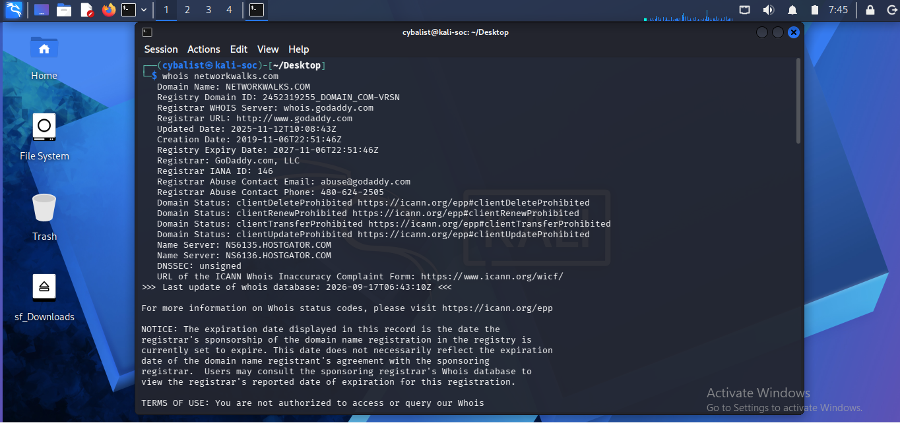
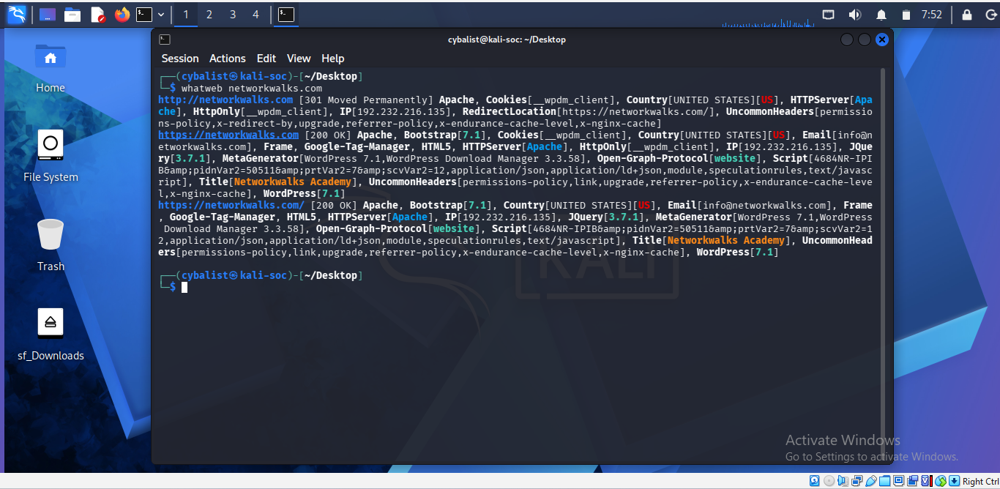
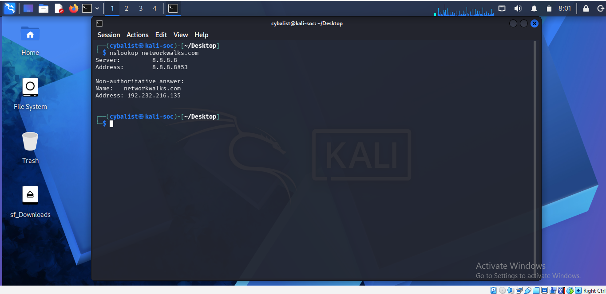
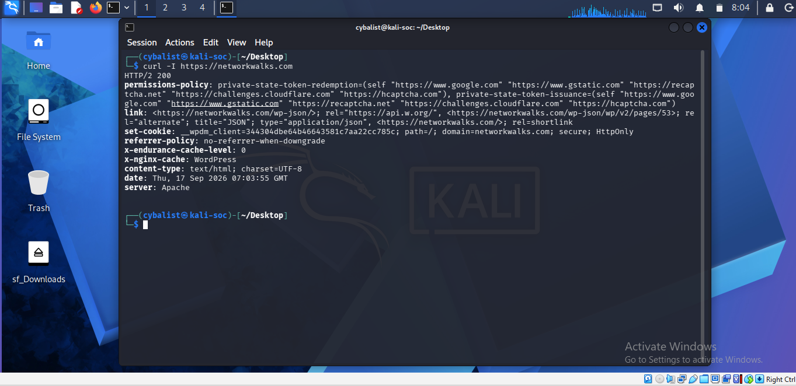
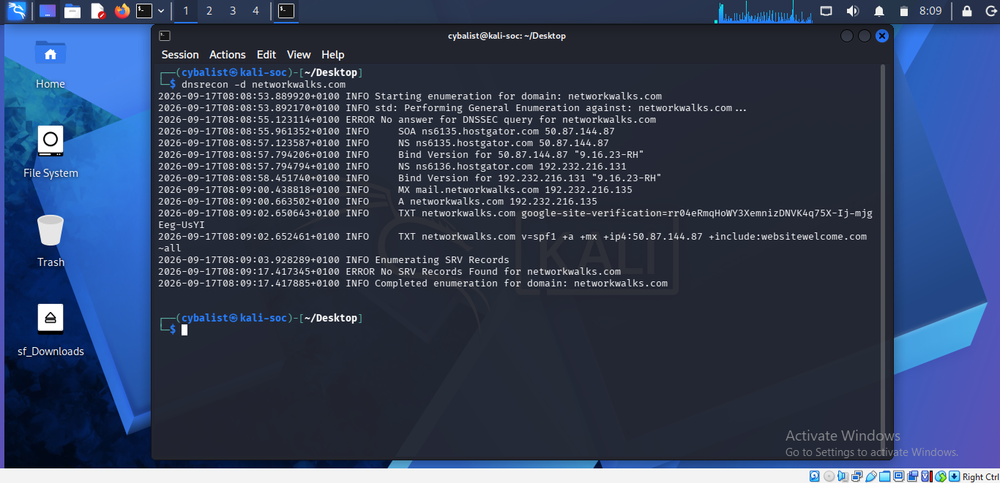

# Cybersecurity & Ethical Hacking — Week 2 Labs

Hands-on labs from Week 2 of a Cybersecurity & Ethical Hacking course, covering passive reconnaissance against a live website and active host discovery on a local network.

> **Educational purposes only.** All scans were performed either against a designated lab/course target (`networkwalks.com`, using only passive, publicly-available information) or against my own local network. Do not run these tools against systems you do not own or have explicit written permission to test.

---

## Repository Structure

```
cybersecurity-week2-labs/
├── README.md
├── Week2_Project_Report.docx
├── PM1-footprinting/
│   ├── whois.txt
│   ├── whatweb.txt
│   ├── nslookup.txt
│   ├── curl.txt
│   ├── wafw00f.txt
│   ├── dnsrecon.txt
│   └── screenshots/
│       ├── 1-whois.png
│       ├── 2-whatweb.png
│       ├── 3-nslookup.png
│       ├── 4-curl.png
│       ├── 5-wafw00f.png
│       └── 6-dnsrecon.png
└── PM5-zenmap/
    ├── ipconfig.txt
    ├── nmap-scan.txt
    ├── zenmap-topology.pdf
    └── screenshots/
        ├── 1-zenmap-install.png
        ├── 2-ipconfig.png
        ├── 3-ping-scan.png
        └── 4-topology.png
```


## Module 1 — Footprinting & Reconnaissance (PM1)

**Target:** `networkwalks.com`
**Tools:** `whois`, `whatweb`, `nslookup`, `curl`, `wafw00f`, `dnsrecon` (Kali Linux)

Reconnaissance (footprinting) is the first stage of any real attack or security assessment. Before touching a target, an attacker quietly collects public information about it — who owns the domain, its real IP, hosting provider, web technologies, DNS/mail records, and whether a firewall is protecting it. All of this comes from information the target has already made public, which is what makes recon so effective and so hard to detect.

### Task 1 — Whois Lookup

**Command:**
```
whois networkwalks.com
```

**Findings:**
- Registrar: GoDaddy.com, LLC
- Domain created: 2019-11-06 | Registry expiry: 2027-11-06
- Name servers: `NS6135.HOSTGATOR.COM`, `NS6136.HOSTGATOR.COM` → reveals **HostGator** as the hosting provider

**How an attacker uses this:** whois reveals the registrar, registration/expiry dates, and name servers. Knowing the hosting provider and abuse contacts helps with reconnaissance and social engineering planning.



---

### Task 2 — WhatWeb Fingerprinting

**Command:**
```
whatweb networkwalks.com
```

**Findings:**
- CMS: WordPress 7.0.4, with plugin WP Download Manager 3.3.58
- Web server: Apache | Bootstrap 7.0.4 | jQuery 3.7.1
- Server IP: `192.232.216.135`

**How an attacker uses this:** whatweb exposes exact software and versions. An attacker checks these against public vulnerability databases (CVE / Exploit-DB) to find known exploits for that specific WordPress/plugin version.



---

### Task 3 — Nslookup (Resolve Domain to IP)

**Command:**
```
nslookup networkwalks.com
```

**Findings:**
- Resolved IP address: `192.232.216.135`

**How an attacker uses this:** knowing the real IP lets an attacker scan the server directly, check for other sites hosted on the same IP, and map the target's infrastructure.



---

### Task 4 — Curl (HTTP Response Headers)

**Command:**
```
curl -I https://networkwalks.com
```

**Findings:**
- Server: Apache | caching header: `x-nginx-cache: WordPress`
- Discovered endpoint: `/wp-json/` (WordPress REST API)
- `Set-Cookie: __wpdm_client` (from the WP Download Manager plugin)

**How an attacker uses this:** HTTP headers leak the server/caching stack and hidden endpoints without needing to load the full page, letting an attacker fingerprint the stack quickly.



---

### Task 5 — Wafw00f (WAF Detection)

**Command:**
```
wafw00f networkwalks.com
```

**Findings:**
- The site is behind **ModSecurity (SpiderLabs)** WAF

**How an attacker uses this:** knowing a WAF is present shapes the whole attack strategy — naive exploitation attempts will be logged or blocked, so an attacker must be more careful or attempt WAF-bypass techniques.


---

### Task 6 — Dnsrecon (DNS Enumeration)

**Command:**
```
dnsrecon -d networkwalks.com
```

**Findings:**
- Name servers: `NS6135`/`NS6136.hostgator.com` running Bind 9.16.23-RH
- Mail server (MX): `mail.networkwalks.com` → `192.232.216.135`
- SPF record: `v=spf1 +a +mx +ip4:50.87.144.87 +include:websitewelcome.com ~all`
- SRV records: 8 records found for `_autodiscover._tcp` pointing to `cpanelemaildiscovery.cpanel.net` (cPanel mail autodiscovery)

**How an attacker uses this:** dnsrecon maps the target's entire DNS footprint (mail servers, DNS software version, SPF policy, cPanel service records) — each a potential foothold and clue to the hosting/email setup.



---

### Why Footprinting Matters

None of the tools above attack the target directly — they only read what is already public, which is exactly why footprinting is powerful and hard to detect. The more an organization leaks publicly, the easier every later attack stage becomes; this is also why defenders run these same tools against themselves.

---

## Module 2 — Network Scanning with Zenmap (PM5)

**Target:** Local LAN (`10.102.174.0/24`)
**Tool:** Zenmap (Nmap GUI)

Zenmap is the official GUI front-end for Nmap, used to discover live hosts on a network, identify open ports, and visualize network topology.

### Task 1 — Download & Install Zenmap

Downloaded the Windows installer from [nmap.org/download.html](https://nmap.org/download.html) and installed with default components (including Zenmap GUI and Npcap).


---

### Task 2 — Find Local IP Address & LAN Subnet

**Command:**
```
ipconfig
```

**Findings:**
- Wireless LAN adapter Wi-Fi — IPv4 Address: `10.102.174.200`
- Subnet Mask: `255.255.255.0`
- Default Gateway: `10.102.174.10`
- **LAN subnet:** `10.102.174.0/24`


---

### Task 3–5 — Find Live Hosts, Count Them, List IPs

**Command (Zenmap Ping scan):**
```
nmap -sn 10.102.174.0/24
```

**Output:**
```
Nmap scan report for 10.102.174.10
Host is up (0.010s latency).
MAC Address: 6A:B8:E3:80:B8:F7 (Unknown)
Nmap scan report for 10.102.174.200
Host is up.
Nmap done: 256 IP addresses (2 hosts up) scanned in 3.71 seconds
```

**Findings:**
- **2 hosts live:** `10.102.174.10` (gateway/router), `10.102.174.200` (this PC)


---

### Task 6 — MAC Addresses of Live Hosts

- `10.102.174.10` → `6A:B8:E3:80:B8:F7`
- `10.102.174.200` → not shown by Nmap for the local host itself; obtained via `ipconfig /all` (Physical Address under Wireless LAN adapter Wi-Fi)

---

### Task 7 — Save Output Topology as PDF

Opened the Topology tab in Zenmap, enabled the Legend, adjusted zoom/ring gap for readability, and exported as [`zenmap-topology.pdf`](./PM5-zenmap/zenmap-topology.pdf).


**Note:** Only 2 hosts appeared in the scan — consistent with a Wi-Fi network using client/AP isolation, which prevents connected devices from seeing each other.

---

## Full Report

See [`Week2_Project_Report.docx`](./Week2_Project_Report.docx) for the complete write-up with all screenshots, command outputs, and analysis of how each tool's findings could be used by an attacker during the reconnaissance phase of a penetration test.

---

## Tools Used

- Kali Linux (`whois`, `whatweb`, `nslookup`, `curl`, `wafw00f`, `dnsrecon`)
- Nmap / Zenmap
- Windows 10/11 (Command Prompt / `ipconfig`)

## Course

Labs completed as part of the Cybersecurity & Ethical Hacking course by [NetworkWalks](https://networkwalks.com).
